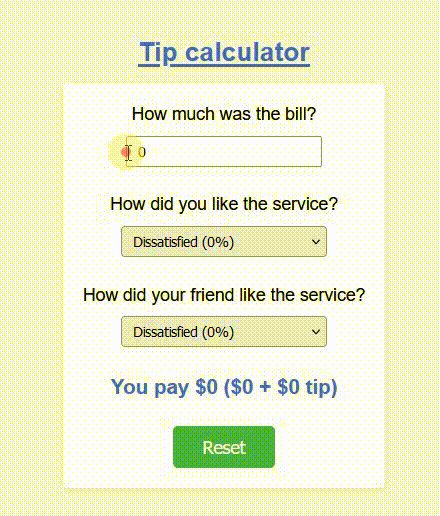

# React - Tip calculator

# 🔗 [Live Preview](https://sparkling-sunburst-2c3069.netlify.app/)

---

## About 👋

This React application is a practice project in whice we calculate the tip based on the base money spent and the satisfaction of the people, it is demonstrating several key concepts.

---

## Key concepts 👨‍💻

- Lifting State Up: Managing shared state (bill amount, percentages) in the parent component `App` allows for centralized control and easier updates.

- Controlled Elements: Input fields `BillInput` and select elements `Percentage` are controlled by state in the parent component, ensuring data reflects user interaction.

- Passing Children Props: The `Percentage` component accepts content `children` as a prop, allowing for customization of the service satisfaction question.

---

## Explanation 🧠

The project consists of three main components:

- App.js: The main component that manages the overall state (bill amount, percentages) and renders the other components.

- BillInput.js: A reusable component for the bill input field. It is a controlled component, where the parent component `App` holds the state for the bill amount and updates it based on user input.

- Percentage.js: A reusable component for the service satisfaction percentage selection. It is also a controlled component, with the parent (App) managing the state for both percentages. Additionally, it allows customization of the question using the `children` prop.

### Lifting State Up:

- The state for `bill`, `percentage1`, and `percentage2` is managed in the `App` component, making them accessible to both `BillInput` and `Percentage`. This ensures all components have access to the latest values and simplifies updates.

### Controlled Elements:

- Both the bill input and the percentage selection elements are controlled components. This means their values are controlled by the state in the parent `App` component, and updates are handled by event handlers `onChange` that pass the updated values back to the parent state.

### Passing Children Props:

- The `Percentage` component accepts the question text as a `children` prop, allowing you to customize the service satisfaction question for each instance. This promotes flexibility in displaying different questions.

---

## Languages

- React: functions, useState, components, props, derived state, lifting state
- Styling: basic
